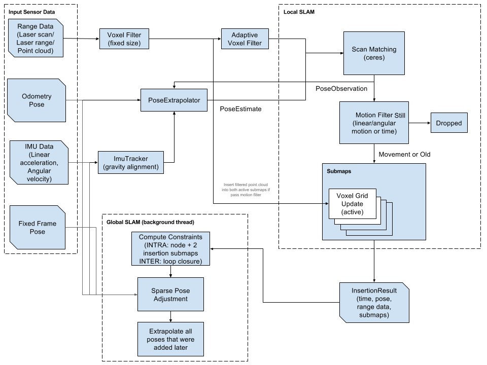
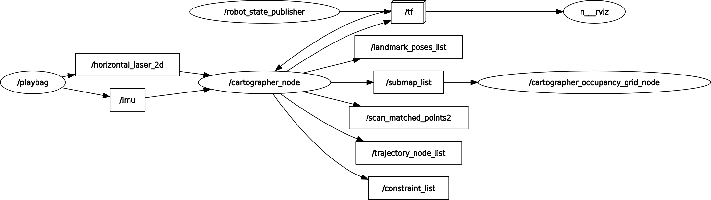

Up Level: (parent:: [Slam Framework](Slam%20Framework.md))
#U

# Reference

1. [Installation - Ceres Solver](http://ceres-solver.org/installation.html)
2. [Compiling Cartographer ROS - Cartographer ROS documentation](https://google-cartographer-ros.readthedocs.io/en/latest/compilation.html)
3. [Cartographer - Cartographer documentation](https://google-cartographer.readthedocs.io/en/latest/)
- [Real-Time Loop Closure in 2D LIDAR SLAM](Cartographer/Real-Time%20Loop%20Closure%20in%202D%20LIDAR%20SLAM.pdf)
- [Real-time correlative scan matching](Cartographer/Real-time%20correlative%20scan%20matching.pdf)
- [Markov localization using correlation](Cartographer/Markov%20localization%20using%20correlation.pdf)
- [Efficient Sparse Pose Adjustment for 2D Mapping](Cartographer/Efficient%20Sparse%20Pose%20Adjustment%20for%202D%20Mapping.pdf)
- [a_flexible_and_scalable_slam_system_with_full_3D_motion_estimation](Cartographer/A_flexible_and_scalable_SLAM_system_with_full_3D_motion_estimation.pdf)
- [A Tutorial on Graph-Based SLAM](Cartographer/A%20Tutorial%20on%20Graph-Based%20SLAM.pdf)
- [A Comparison of Graph Optimization Approaches for Pose Estimation in SLAM](Slam%20Framework/A%20Comparison%20of%20Graph%20Optimization%20Approaches%20for%20Pose%20Estimation%20in%20SLAM.pdf)

# Question
- [x]  How to calculate the relative pose between a scan and its belonging submap?
- [x]  The principle of pose_ekf?
- [x] pose-pose edge, where the virtual measurement between two nodes come from? Fom the output of multi-resolution map CSM  ✅ 2023-02-23

# Compile problem


```bash
## No lua >= 5.2 was found
## https://www.lua.org/download.html
## https://www.daimajiaoliu.com/daima/7123bc159bd5801
## fatal error: readline/readline.h: No such file or directory
#sudo apt install liblua5.2-0 
sudo apt install liblua5.2-dev

##
<== Failed to process package 'cartographer':
  Command '['/home/funstep/catkin_ws/install_isolated/env.sh', 'ninja', '-j4', '-l4']' returned non-zero exit status 1
##
protoc --version
remove protoc if its version is not 3.6.1
sudo apt install libprotobuf-dev

##
/usr/bin/ld: /usr/local/lib/liblua.a(loadlib.o): undefined reference to symbol 'dlsym@@GLIBC_2.17'
##
sudo ldconfig

## 
undefined protobuf::members
##
sudo apt install protobuf-compiler

## 
some libraries realted to cuda failed to be found like 
"libcublas.so.10.0: cannot open shared object file: No such file or directory" and lead to
"Ninja -8 -j 8"
## 
usually caused by the updating of cuda | gpu, in this case, you need to recompile ceresolve and do not forget to "sudo make install", then you may need to recompile cartographer (one of dependancies of cartographer is ceresolver)
```

# Structure



Node structure from rqt_graph in the mobile robot


[carto_rosgraph.dot](Cartographer/carto_rosgraph.dot)

Node structure from rqt_graph in 2d demo




# Key components

## PoseExtrapolator


<p align="center"> _figure 1. IMU interpolation layout_ </p>
Considering that there is no enough IMU and odometer data. If IMU data is available, time is decided by IMU, velocity is decided by otometer (F) or fixed frames (Sec);

```cpp
Eigen::Vector3d PoseExtrapolator::ExtrapolateTranslation(common::Time time) {
  const TimedPose& newest_timed_pose = timed_pose_queue_.back();
  const double extrapolation_delta =
      common::ToSeconds(time - newest_timed_pose.time);

  //okagv
  if(odometry_data_.size()!=0)
  {
      const double check_odometry_time =
      common::ToSeconds(time - odometry_data_.back().time);

  //cartographer
  if (odometry_data_.size() < 2) {
    return extrapolation_delta * linear_velocity_from_poses_;
  }
  return extrapolation_delta * linear_velocity_from_odometry_;
}

Eigen::Quaterniond PoseExtrapolator::ExtrapolateRotation(
    const common::Time time, ImuTracker* const imu_tracker) const {
      //LOG(INFO) << "peak start ExtrapolateRotation ";
  CHECK_GE(time, imu_tracker->time());
  AdvanceImuTracker(time, imu_tracker);
  const Eigen::Quaterniond last_orientation = imu_tracker_->orientation();
  return last_orientation.inverse() * imu_tracker->orientation();
}
```

## CSM using DFS Branch-bundle scan match

[CSM explain](Cartographer/CSM%20explain.pdf)

## gazebo and cartographer

to apply cartographer on gazebo simulation, the "config/turtlebot3_lds_2d.lua" need to be modifies. The tracking frame is set to "base_footprint" insead of "imu_link".
- [ ] #Ques  Only modify launch by replacing .lua file can not work. 🛫 2023-02-17 