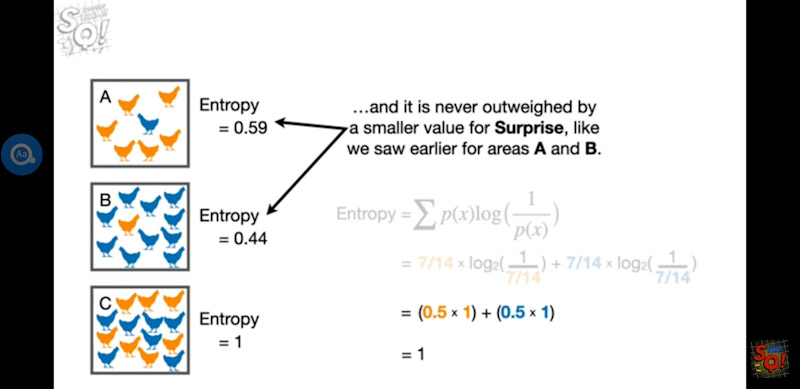
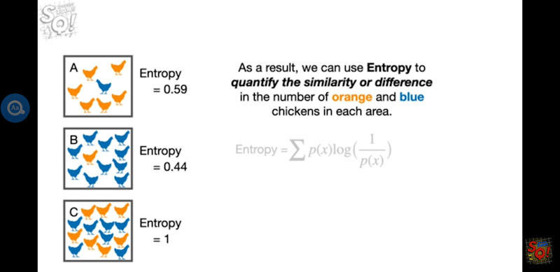
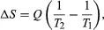

Up Level: (parent:: [Meditation](Meditation.md))

### Question
- [ ] What enlightenment does it offer to my life?

# Mathematical definition

https://youtu.be/YtebGVx-Fxw

# Physical definition

Assume that there are two heat reservoirs R1 and R2 at temperatures T1 and T2 (such as the stove and the block of ice). If an amount of heat Q flows from R1 to R2, then the net entropy change for the two reservoirs is

# Comic entropy

What entropy actually measures, rather than some nebulous characteristic like disorder, is this: the number of possible arrangements of the quantum state of your entire system.

https://www.forbes.com/sites/startswithabang/2020/11/13/ask-ethan-did-the-universe-have-zero-entropy-at-the-big-bang/?sh=188a3a1238c0

Example

_A system set up in the initial conditions on the separated arears_

Consider the two systems above, for example. On the left, a box with a divider in the middle has cold gas on one side and hot gas on the other; on the right, the divider is opened and the entire box has gas of the same temperature. Which system has more entropy? The well-mixed one on the right, because there are more ways to arrange (or swap) the quantum states when all the particles have the same properties than when half have one set of properties and half have another, distinct set of properties.
