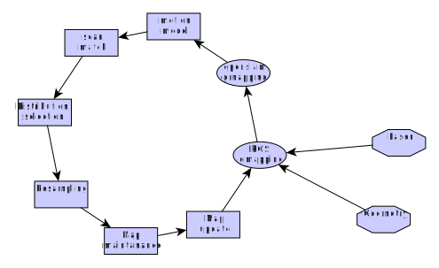
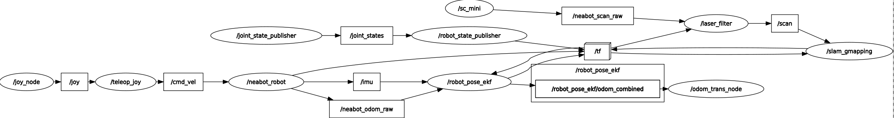

Up Level: (parent:: [Slam Framework](Slam%20Framework.md))
#gmapping 

### Reference

> [scanmatcher](Gmapping/param/scanmatcher.pdf)
> [RaoBlackwellized Particle Filters.3853](Gmapping/RaoBlackwellized%20Particle%20Filters.3853.pdf)
> [Improved Techniques for Grid Mapping with Rao-Blackwellized Particle Filters](Gmapping/param/Improved%20Techniques%20for%20Grid%20Mapping%20with%20Rao-Blackwellized%20Particle%20Filters.pdf)
> [Improving Grid-based SLAM with Rao-Blackwellized Particle Filters by Adaptive Proposals and Selective Resampling](Gmapping/Improving%20Grid-based%20SLAM%20with%20Rao-Blackwellized%20Particle%20Filters%20by%20Adaptive%20Proposals%20and%20Selective%20Resampling.pdf)

### Question

- [x]  what is the map?   point position and occupied and visited value.
- [x]  what map it shows in rviz? the map maintained by the particle with maximum weight.
- [x]  what role does the imu play in gmapping? As an input of pose_ekf combined with the odometer to estimate the robot’s positiontion
- [ ]  How to calibrate the odometer?  [https://zhuanlan.zhihu.com/p/538697301](https://zhuanlan.zhihu.com/p/538697301)
    
    /slam_course/slam14-least-squares.pptx
    
- [x]  How to calculate the likelihood of observation?   transform laser points z to world coordinates, the point in map represent possibility.
- [x]  the relation between particle weights and the close-loop? with small close-loop or small area with more features, the particle weights is concentrate more effectively.
- [x]  the contour of particles.

❗ The factorization is proposal and target distribution is different.

---

# Structure

[gmapping.dot](Gmapping/gmapping.dot)



ROS rviz flowchart



# Improved distribution

## Model


$$
\begin{aligned}w_{t}^{(i)} &=w_{t-1}^{(i)} \frac{\eta p\left(z_{t} \mid m_{t-1}^{(i)}, x_{t}^{(i)}\right) p\left(x_{t}^{(i)} \mid x_{t-1}^{(i)}, u_{t-1}\right)}{p\left(x_{t} \mid m_{t-1}^{(i)}, x_{t-1}^{(i)}, z_{t}, u_{t-1}\right)} \\& \propto w_{t-1}^{(i)} \frac{p\left(z_{t} \mid m_{t-1}^{(i)}, x_{t}^{(i)}\right) p\left(x_{t}^{(i)} \mid x_{t-1}^{(i)}, u_{t-1}\right)}{\frac{p\left(z_{t} \mid m_{t-1}^{(i)}, x_{t}\right) p\left(x_{t} \mid x_{t-1}^{(i)}, u_{t-1}\right)}{p\left(z_{t} \mid m_{t-1}^{(i)}, x_{t-1}^{(i)}, u_{t-1}\right)}} \\&=w_{t-1}^{(i)} \cdot p\left(z_{t} \mid m_{t-1}^{(i)}, x_{t-1}^{(i)}, u_{t-1}\right) \\&=w_{t-1}^{(i)} \cdot \int p\left(z_{t} \mid x^{\prime}\right) p\left(x^{\prime} \mid x_{t-1}^{(i)}, u_{t-1}\right) d x^{\prime}\end{aligned}
$$

## Pseudocode

$$
\begin{array}{l}\text { if } \hat{x}_{t}^{(i)}=\text { failure then } \\x_{t}^{(i)} \sim p\left(x_{t} \mid x_{t-1}^{(i)}, u_{t-1}\right) \\w_{t}^{(i)}=w_{t-1}^{(i)} \cdot p\left(z_{t} \mid m_{t-1}^{(i)}, x_{t}^{(i)}\right) \\\text { else } \\\quad / / \text { sample around the mode } \\\text { for } k=1, \ldots, K \text { do } \\\quad x_{k} \sim\left\{x_{j}|| x_{j}-\hat{x}^{(i)} \mid<\Delta\right\} \\\text { end for } \\\text { // compute Gaussian proposal } \\\mu_{t}^{(i)}=(0,0,0)^{T} \\\eta^{(i)}=0 \\\text { for all } x_{j} \in\left\{x_{1}, \ldots, x_{K}\right\} \text { do } \\\quad \mu_{t}^{(i)}=\mu_{t}^{(i)}+x_{j} \cdot p\left(z_{t} \mid m_{t-1}^{(i)}, x_{j}\right) \cdot p\left(x_{t} \mid x_{t-1}^{(i)}\right. \\\quad \eta^{(i)}=\eta^{(i)}+p\left(z_{t} \mid m_{t-1}^{(i)}, x_{j}\right) \cdot p\left(x_{t} \mid x_{t-1}^{(i)}, u_{t}\right. \\\text { end for } \\\mu_{t}^{(i)}=\mu_{t}^{(i)} / \eta^{(i)} \\\Sigma_{t}^{(i)}=\mathbf{0} \\\text { for all } x_{j} \in\left\{x_{1}, \ldots, x_{K}\right\} \text { do } \\\quad \Sigma_{t}^{(i)}=\Sigma_{t}^{(i)}+\left(x_{j}-\mu^{(i)}\right)\left(x_{j}-\mu^{(i)}\right)^{T} \\\quad p\left(z_{t} \mid m_{t-1}^{(i)}, x_{j}\right) \cdot p\left(x_{j} \mid x_{t-1}^{(i)}, u_{t-1}\right) \\\text { end for } \\\Sigma_{t}^{(i)}=\Sigma_{t}^{(i)} / \eta^{(i)} \\/ / s_{t} \text { sample new pose } \\x_{t}^{(i)} \sim \mathcal{N}\left(\mu_{t}^{(i)}, \Sigma_{t}^{(i)}\right) \\w_{t}^{(i)}=w_{t-1}^{(i)} \cdot \eta^{(i)}\end{array}
$$

## Result


# Resampling

After every resampling, weight of all particles is set to be even.

```matlab
% resample the set of particles.
% A particle has a probability proportional to its weight to get selected. A good option for such a resampling method is the so-called low variance sampling, Probabilistic Robotics pg. 109
function newParticles = resample(particles)

numParticles = length(particles);

w = [particles.weight];

% normalize the weight
w = w / sum(w);

% consider number of effective particles, to decide whether to resample or not
useNeff = false;
%useNeff = true;
if useNeff
  neff = 1. / sum(w.^2);
  neff
  if neff > 0.5*numParticles
    newParticles = particles;
    for i = 1:numParticles
      newParticles(i).weight = w(i);
    end
    return;
  end
end

newParticles = struct;

% TODO: implement the low variance re-sampling

% the cummulative sum
cs = cumsum(w);
weightSum = cs(length(cs));

% initialize the step and the current position on the roulette wheel
step = weightSum / numParticles;
position = unifrnd(0, weightSum);
idx = 1;

% walk along the wheel to select the particles
for i = 1:numParticles
  position += step;
  if (position > weightSum)
    position -= weightSum;
    idx = 1;
  end
  while (position > cs(idx))
    idx++;
  end
  newParticles(i) = particles(idx);
  newParticles(i).weight = 1/numParticles;
end

end
```

# Pros & Cons

++ easy to understand, small amount of computing

---

— Large space is needed for each particle maintaining a map. 

For example: 5 cm grid unit size to build a 200 x 200 m area, with 100 particle and 1 byte storage for grid unit data, then it need (square(200/0.05)*100*1) = 1.6 G memory size to store the map.

— Largely depend on the odometer, need accurate calibration of the sensor. 


# Compare with other Laser-based SLAM

-