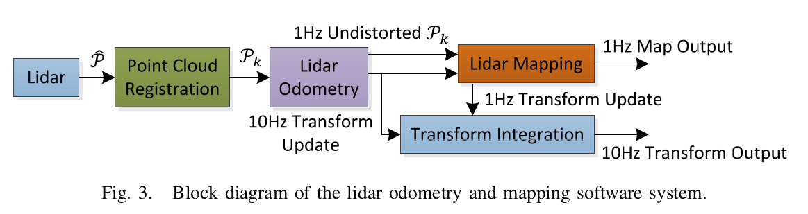
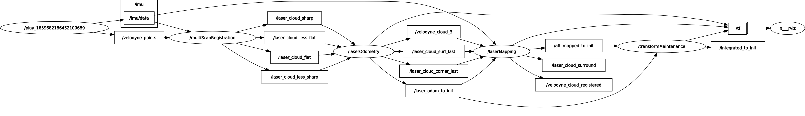

Up Level: (parent:: [Slam Framework](Slam%20Framework.md))

### Reference
1. [LOAM源码解析1--scanRegistration](https://zhuanlan.zhihu.com/p/145857388)
2. [A_LOAM源码解析2--laserOdometry](https://zhuanlan.zhihu.com/p/396331443)
3. [LOAM 代码部分的公式推导（前端里程计部分）](https://www.shangyexinzhi.com/article/4157317.html)

- [LOAM-Lidar Odometry and Mapping in Real-time](SLAM/LeGo-Loam/LOAM-Lidar%20Odometry%20and%20Mapping%20in%20Real-time.pdf)
- [Low-drift and real-time lidar odometry and mapping](SLAM/LeGo-Loam/Low-drift%20and%20real-time%20lidar%20odometry%20and%20mapping.pdf)
- [On Degeneracy of Optimization-based State Estimation Problems](SLAM/LeGo-Loam/On%20Degeneracy%20of%20Optimization-based%20State%20Estimation%20Problems.pdf)
- [Enabling Aggressive Motion Estimation at Low-drift and Accurate Mapping in Real-time](SLAM/LeGo-Loam/Enabling%20Aggressive%20Motion%20Estimation%20at%20Low-drift%20and%20Accurate%20Mapping%20in%20Real-time.pdf)

### Question

- [x]  How to get S, which contains half of its points on each side of i and 0.25 intervals between two points. This is specially for 2d lidar with an extra rotation
- [x]  How to separate a scan into four identical subregions.   scan_ID for velodyne
- [x]  How to reproject pk to bar(pk)?   IMU compensation
- [x]  what is the iteration used for in lidar odometry?  number of running L-M with collected constraints, default is 10 hz.
- [x]  Which cloud point we extract corresponding feature for lidar odometry algorithm?    tilde (p(k))
- [ ]  Is Raspberry powerful enough to run it?
- [x]  is imu compensation also used in the odometry part? If yes, how is it involved?  No.

---

# Install

[https://github.com/laboshinl/loam_velodyne](https://github.com/laboshinl/loam_velodyne)

## Problem and Solution

```bash
## 
dataset not found
##
download the bag files in the following link:
http://wiki.ros.org/loam_velodyne

##
[multiScanRegistration-1] process has died [pid 18786, exit code -1
##
uncomment "#add_definitions( -march=native )" in file "loam_velodyne/CMakesLists.txt"

##
Error transforming odometry 'Odometry' from frame '/camera_init' to frame 'camera_init'
##
replace all "/camera_init" with "camera_init" in src files

```

# Purpose

minimizing drift in odometry estimation

# Lacking function

 currently not involving loop closure

# Contribution

- our method can provide motion estimates for guidance of an autonomous vehicle.
- the method takes advantage of the lidar scan pattern and point cloud distribution

# Structure




rqt_graph flowchart



## point cloud register

### pre-process of point cloud

separate each points in the point cloud into different scans based on their elevation angle. The timestamp of every point is also recorded.

remove NAN point → initialize scan ID→ normalize angle → calculate realtime → imu compensation


```cpp
setIMUTransformFor(relTime); // calculate the ratio among imu_back, point_time and imu_front; relTime (relative time to the start point of a sweep)
transformToStartIMU(point); // rotate point to global IMU system (imu_cur) -> add global IMU position shift -> rotate point back to local IMU system relative to the start IMU
```

### extract feature

point’s curvature, the points with highest c-value are regarded as edge features while the points with lowest c-value regarded as planar features.

```bash
cloudCurvature[i] = diffX * diffX + diffY * diffY + diffZ * diffZ;
```

remove outlier


## laser odometry

### find feature correspondence

edge correspondence:

Find the values for all i points that can make the square of their distance from line lj is the minimum.


planar correspondence:

Find the values for all i points that can make the square of their distance from plane mlj is the minimum.


 
### calculate distance

distance between each feature in frame k+1 and its correspondent one in frame k.

- Distance of edge point to correspondent line


- Distance of planar point to correspondent surface


### motion estimation

The lidar motion is modeled with constant angular and linear velocities during sweep. In the end of each sweep, all points in the sweep are transformed by transformToEnd();

```cpp
// this funciton is to reproject the point into the time in the start scan, which can be later used for a constraint with correponding feature. 
// Tips: it is similar to transformtoIMUStart(), the latter is used to reduce motion distortion in pre-process of the raw cloud point.
void BasicLaserOdometry::transformToStart(const pcl::PointXYZI& pi, pcl::PointXYZI& po)
{
	// interpolation for specific point’s rigid motion;
   float s = (1.f / _scanPeriod) * (pi.intensity - int(pi.intensity));

   po.x = pi.x - s * _transform.pos.x();
   po.y = pi.y - s * _transform.pos.y();
   po.z = pi.z - s * _transform.pos.z();
   po.intensity = pi.intensity;

   Angle rx = -s * _transform.rot_x.rad();
   Angle ry = -s * _transform.rot_y.rad();
   Angle rz = -s * _transform.rot_z.rad();
   rotateZXY(po, rz, rx, ry);
}
```


### lidar mapping

the transform matrix T(k+1) from last sweep will be further optimized by scan matching between tilde(P(k+1)) and near part of Q(k). The feature extraction method is same as the laser point registration but 10 times of them. After which, mapping is conducted as batch optimization (similar to iterative closest point (ICP) methods [9]) to produce high-precision motion estimates and maps.n


In the mapping algorithm, the correspondences are determined by examining geometric distributions of local point clusters, through the associated eigenvalues and eigenvectors, etc.. However, these methods are computing-cost.

# Appendix

velodyne data package format and process:

data package: 雷达扫描频率为10Hz，每秒数据包在480帧左右，即每次扫描会产生48个左右的数据包，需要将分散的数据包数据合并称为一次扫描的点云数据

[Velodyne-16c激光雷达数据包解析与坐标计算方法](https://www.likecs.com/show-203959652.html)

我们得到了一帧数据，但这个数据的每个点都是有自己的时间点的，如果要把他做成一个只有唯一时间点的点云，还需要把时间统一到某个特定的时间点（例如第一个时间点），并根据时间间隔来调整位置，这个调整，需要根据IMU的数据来做。

[Velodyne的数据格式和驱动程序](https://zhuanlan.zhihu.com/p/60898659)