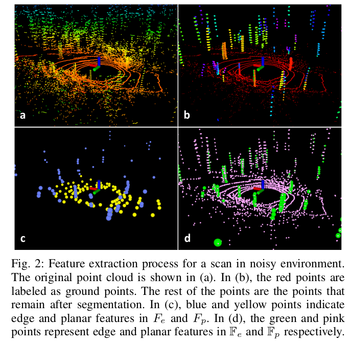

Up Level: (parent:: [Slam Framework](Slam%20Framework.md))

### Reference

[https://github.com/wykxwyc/LeGO-LOAM_NOTED](https://github.com/wykxwyc/LeGO-LOAM_NOTED)
[Lego-LOAM IMU坐标系变换的详细记录_北叶、的博客-CSDN博客_imu坐标系转换](https://blog.csdn.net/qq_39099999/article/details/124908363)
> [lego_loam](SLAM/LeGo-Loam/lego_loam.pdf)

### Question

- [x] In close-loop, “if a match is found between the current …”, how to determine this match?
- [ ]  Why loose couple with IMU?

---

# Improvement over loam

## Segmentation module

It put into a new module called segmentation in pre-process, which takes a single scan’s point cloud and projects it onto a range image for segmentation. 

The features are extracted from ground points and segmented points. To evenly extract features from all direction, it divide the range image horizontally into several equal sub-images. Based on this new modules, lidar odometry can realize faster calculation by

- Lable matching: using opencv to lable range image.l
- Two-step L-M optimization: the optimal transformation in loam is found in two parts:
    
    
    

## Close-loop

