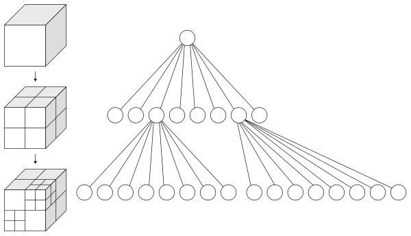

Up Level: (parent:: [Point Cloud Processing](Point%20Cloud%20Processing.md))

# what is octree

An **octree** is a [tree data structure](https://en.wikipedia.org/wiki/Tree_data_structure)  in which each [internal node](https://en.wikipedia.org/wiki/Internal_node) has exactly eight [children](https://en.wikipedia.org/wiki/Child_node). Octrees are most often used to partition a [three-dimensional space](https://en.wikipedia.org/wiki/Three-dimensional_space) by [recursively subdividing](https://en.wikipedia.org/wiki/Recursive_subdivision) it into eight octants. Octrees are the three-dimensional analog of [quadtrees](https://en.wikipedia.org/wiki/Quadtree). The word is derived rom *oct*(Greek root meaning "eight") + *tree*. Octrees are often used in [3D graphics](https://en.wikipedia.org/wiki/3D_graphics) and 3D [game engines](https://en.wikipedia.org/wiki/Game_engine).



# code

Matlab code

```matlab
% Read the original RGB image
Img = imread('IMG_9980.CR2');
% Extract pixels as RGB point triplets
pts = reshape(Img,[],3);
% Create OcTree decomposition object using a target bin capacity
OT = OcTree(pts,'BinCapacity',ceil((size(pts,1) / 256) *7));
% Find which bins are "leaf nodes" on the octree object
leafs = find(~ismember(1:OT.BinCount, OT.BinParents) & ...
    ismember(1:OT.BinCount,OT.PointBins));
% Find the central RGB location of each leaf bin
binCents = mean(reshape(OT.BinBoundaries(leafs,:),[],3,2),3);
 
% Make a new "indexed" image with a color map
ImgIdx = zeros(size(Img,1), size(Img,2));
for i = 1:length(leafs)
    pxNos = find(OT.PointBins==leafs(i));
    ImgIdx(pxNos) = i;
end
ImgMap = binCents / 255; % Convert 8-bit color to MATLAB rgb values
 
% Display the original 532818-color image and resulting 184-color image 
figure
subplot(1,2,1), imshow(Img)
title(sprintf('Original %d color image', size(unique(pts,'rows'),1)))
subplot(1,2,2), imshow(ImgIdx, ImgMap)
title(sprintf('Octree-quantized %d color image', size(ImgMap,1)))
```

octree API:

[octree - partitioning 3D points into spatial subvolumes](https://ww2.mathworks.cn/matlabcentral/fileexchange/40732-octree-partitioning-3d-points-into-spatial-subvolumes)

# quadtree

[Construct Quad Tree - LeetCode](https://leetcode.com/problems/construct-quad-tree/)

```cpp
class Solution {
public:
    Node* construct(vector<vector<int>>& grid) {
        int N = size(grid[0]);
        return recur(grid, 0, N, 0, N);
    }
    
    Node* recur(vector<vector<int>>& grid, int r0, int r1, int c0, int c1){
        for (int i = r0; i < r1; i++){
            for (int j = c0; j < c1; j++){
                if (grid[i][j] != grid[r0][c0]){
                    int rm = (r0 + r1) / 2;
                    int cm = (c0 + c1) / 2;
                    return new Node(
                        true,
                        false,
                        recur(grid, r0, rm, c0, cm),
                        recur(grid, r0, rm, cm, c1),
                        recur(grid, rm, r1, c0, cm),
                        recur(grid, rm, r1, cm, c1)
                    );
                }
            }
        }
        return new Node(grid[r0][c0], true);
    }
};
```