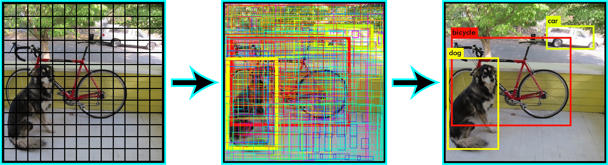

# NMS (Non-Maximum-Supression)

[NMS(非极大值抑制算法) ~ cowarder](https://cowarder.site/2019/12/25/NMS/)

procedure:

1. Input: box group $B$, and corresponding IOU threshold $T$
2. new an empty group $D$, used for saving final result
3. sorting the box in $B$ in descending order
4. select the box $m$ with maximum score (area) , put it into $D$
5. calculate the IOU between $m$  and the rest boxes in $B$, remove all boxes of which the IOU is larger than $T$
6. repeat steps 4-5, until $B$  is empty
7. output: $D$