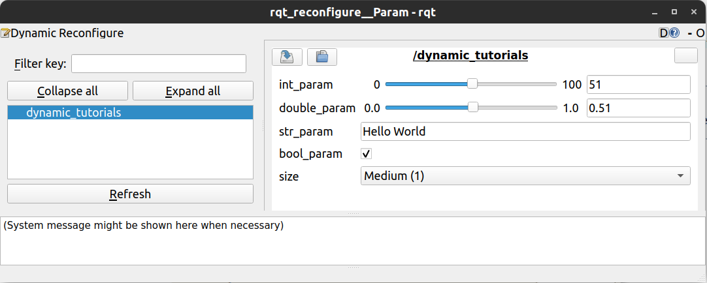

Up Level: (parent:: [Linux](Linux.md))

# Difference between spin() and spinonce

[ros::spin()、ros::spinOnce()：使用细节、区别_默_存的博客-CSDN博客_ros::spinonce](https://blog.csdn.net/weixin_40215443/article/details/103793316)

Both spin() and spinonce() are responsible for handling communication events. spin() would block until it invokes a shutdown, while spinonce() handles the events and returns immediately. 

For instance, in a simple publisher-subscriber mode, the publisher keeps sending messages to the topic, when subscriber monitor this message, it would load a callback function with argument from the message into a task line. Spin() keeps monitoring the message until it invokes a shutdown while Spinonce() monitor only once then quit.

# roslaunch

- [arg](http://wiki.ros.org/roslaunch/XML/arg)
    
    ### Attributes
    
    - name="arg_name"
        - Name of argument.
        
        default="default value" *(optional)*
        
        - Default value of argument. Cannot be combined with value attribute.
        
        value="value" *(optional)*
        
        - Argument value. Cannot be combined with default attribute.
        
        doc="description for this arg" *(optional)* **New in Indigo**
        
        - Description of the argument. You could get this through -ros-args argument to the roslaunch command.
    
    ### Examples
    
    **Passing an argument to an included file**
    
    - my_file.launch:
        
        ```
        <include file="included.launch">
          <!-- all vars that included.launch requires must be set -->
          <arg name="hoge" value="fuga" />
        </include>
        ```
        
        included.launch:
        
        ```
        <launch>
          <!-- declare arg to be passed in -->
          <arg name="hoge" />
        
          <!-- read value of arg -->
          <param name="param" value="$(arg hoge)"/>
        </launch>
        ```
        
    
    **Passing an argument via the command-line**
    
    roslaunch uses the same syntax as ROS remapping arguments to specify arg values.
    
    ```bash
    $ roslaunch my_file.launch hoge:=my_value (.launch file is available at the current dir)
    $ roslaunch %YOUR_ROS_PKG% my_file.launch hoge:=my_value
    ```
    
- [param](http://wiki.ros.org/roslaunch/XML/param)
    
    # **Attributes**
    
    - name="namespace/name"
        - Parameter name. Namespaces can be included in the parameter name, but globally specified names should be avoided.
        
        value="value"*(optional)*
        
        - Defines the value of the parameter. If this attribute is omitted, binfile, textfile or command must be specified.
        
        type="str|int|double|bool|yaml"*(optional)*
        
        - Specifies the type of the parameter. If you don't specify the type, roslaunch will attempt to automatically determine the type. These rules are very basic:
            - numbers with '.'s are floating point, integers otherwise;
            - "true" and "false" are boolean (not case-sensitive).
            - all other values are strings
        
        textfile="$(find pkg-name)/path/file.txt"*(optional)*
        
        - The contents of the file will be read and stored as a string. The file must be locally accessible, though it is strongly recommended that you use the package-relative $(find)/file.txt syntax to specify the location.
        
        binfile="$(find pkg-name)/path/file"*(optional)*
        
        - The contents of the file will be read and stored as a base64-encoded XML-RPC binary object. The file must be locally accessible, though it is strongly recommended that you use the package-relative $(find)/file.txt syntax to specify the location.
        
        command="$(find pkg-name)/exe '$(find pkg-name)/arg.txt'"*(optional)*
        
        - The output of the command will be read and stored as a string. It is strongly recommended that you use the package-relative $(find)/file.txt syntax to specify file arguments. You should also quote file arguments using single quotes due to XML escaping requirements.
    
    # Examples
    
    ```
    <param name="publish_frequency" type="double" value="10.0" />
    ```
    
    # Parameters from YAML output
    
    In order to load a YAML file, you can use:
    
    ```
    <rosparam command="load" file="FILENAME" />
    ```
    
    **New in Lunar**
    
    But this doesn't work when using a command which outputs the parameters on stdout. In that case the new param type yaml can be used:
    
    ```
    <param name="params_a" type="yaml" command="cat '$(find roslaunch)/test/params.yaml'" />
    ```
    
    In the above example, the parameters from the described file would be loaded under the local namespace params_a.
    

# wait_for_message() in ros python

This will create a new subscription to the topic, receive one message, then unsubscribe.

(in pseudo-code almost):

1. creates a `rospy.Subscriber`
2. initialises a flag to `False`
3. waits for a single message, which
4. triggers its callback to be called
5. this callback sets the flag to `True`
6. the `True` flag will cause the function to cancel its subscription, and
7. it now returns the message it has received

You could do all of this yourself, but it's much more convenient to have `rospy.wait_for_message(..)` do this for you.

# optenv

$(optenv ENVIRONMENT_VARIABLE) $(optenv ENVIRONMENT_VARIABLE default_value)

- Substitute the value of an environment variable if it is set. If default_value is provided, it will be used if the environment variable is not set.

# eval

<group if="$(eval lidar_type == 'm10')"> balbal </group>

# [TF](http://wiki.ros.org/tf/Tutorials)

```cpp
// sending transform to TF or adding a new frame in TF
br.sendTransform(tf::StampedTransform(transform, ros::Time::now(), parent_node, child_node));

// listening transform from TF
// For tf, time 0 means "the latest available" transform in the buffer.
tf::StampedTransform transform;
try{
  listener.lookupTransform(child_node, parent_node,
                            ros::Time(0), transform);
}
```

# [lint](http://wiki.ros.org/roslint)

CMake lint commands for ROS packages. The lint commands perform static checking of Python or C++ source code for errors and standards compliance.

# [Dynamic_reconfiguration](http://wiki.ros.org/dynamic_reconfigure)

The dynamic_reconfigure package provides a means to update parameters at runtime without having to restart the node.

# [Dynamic Reconfigure](http://wiki.ros.org/dynamic_reconfigure/Tutorials)

The `<name>Config.h` is generated along with source file. In source file , below shows how to use the config

```cpp
dynamic_reconfigure::Server<dynamic_tutorials::TutorialsConfig> server;
dynamic_reconfigure::Server<dynamic_tutorials::TutorialsConfig>::CallbackType f;

f = boost::bind(&callback, _1, _2);
server.setCallback(f); 
```

```bash
rosrun rqt_reconfigure rqt_reconfigure
```



# [Joint and robot state publisher](https://automaticaddison.com/robot-state-publisher-vs-joint-state-publisher/)

Whenever we want a robot to complete a specific task (e.g. move a certain distance in an environment, pick up an object, etc.), we have to have a way to know the position and velocity of each joint at all times. The **Joint State Publisher** does exactly this.

The Joint State Publisher package keeps track of the position (i.e. [angle in radians](https://automaticaddison.com/how-to-control-multiple-servo-motors-using-arduino/) for a [servo motor](https://automaticaddison.com/how-to-determine-what-torque-you-need-for-your-servo-motors/) or [displacement](https://automaticaddison.com/how-to-find-displacement-vectors-for-robotic-arms/) in meters for a [linear actuator](https://en.wikipedia.org/wiki/Linear_actuator)) and [velocity of each joint](https://automaticaddison.com/the-ultimate-guide-to-jacobian-matrices-for-robotics/) of a robot and [publishes these values](https://automaticaddison.com/create-a-publisher-and-subscriber-in-c-ros-2-foxy-fitzroy/) to the ROS system as [sensor_msgs/JointState](http://docs.ros.org/en/api/sensor_msgs/html/msg/JointState.html) messages.

The Robot State Publisher then takes two main inputs:

1. The [sensor_msgs/JointState](http://docs.ros.org/en/api/sensor_msgs/html/msg/JointState.html) messages from the Joint State Publisher.
2. A model of the robot in [URDF file](https://automaticaddison.com/how-to-build-a-simulated-mobile-manipulator-using-ros/) format.

The Robot State Publisher takes that information, outputs the position and orientation of each [coordinate frame of the robot](https://automaticaddison.com/coordinate-frames-and-transforms-for-ros-based-mobile-robots/), and publishes this data to the [tf2 package](http://wiki.ros.org/tf2).

The tf2 package is responsible for keeping track of the position and orientation of all coordinate frames of a robot over time. At any given time, you can [query the tf2 package](https://navigation.ros.org/setup_guides/transformation/setup_transforms.html) to find out the position and orientation of any coordinate frame (i.e. “child frame”) relative to another coordinate frame (i.e. “parent” frame).

# [Time and Walltime](https://blog.csdn.net/sru_alo/article/details/102893536)

一、Time
1、时刻和间隔
ROS 中有 time 和 duration 两种类型，相应的有 ros::Time 和 ros::Duration 类。

time 表示的是时刻
duration 表示的是时间间隔
其统一表示形式为：

int32 sec
int32 nsec
ROS 可以给节点提供一个模拟始时钟。不同于平台时间，你可以利用 roscpp 的时间例程来得到当前的时间，此时间能够和模拟时间、wall-clock 时间进行无缝连接。

1.1 获得当前时间
ros::Time::now()
ros::Time begin = ros::Time::now();
Wall Time

在模拟时，如果想要进入实际运行 wall-clock time ，可以用 ros::WallTime, ros::WallDuration, 和ros::WallRate，类似于 ros::Time, ros::Duration, 和 ros::Rate

---

（1）三种时间的定义

时钟时间(墙上时钟时间wall clock time)：从进程从开始运行到结束，时钟走过的时间，这其中包含了进程在阻塞和等待状态的时间。
用户CPU时间：就是用户的进程获得了CPU资源以后，在用户态执行的时间。
系统CPU时间：用户进程获得了CPU资源以后，在内核态的执行时间。

（2）三者之间的关系

进程的三种状态为阻塞、就绪、运行。
时钟时间 ＝ 阻塞时间 ＋ 就绪时间 ＋运行时间
用户CPU时间 ＝ 运行状态下用户空间的时间
系统CPU时间 = 运行状态下系统空间的时间。
用户CPU时间+系统CPU时间=运行时间。

---

CPU时间

进程时间也称CPU时间，用以度量进程使用的中央处理器资源。进程时间以时钟嘀嗒计算，实际时间（Real），用户CPU时间（User），系统CPU时间（Sys）

实际时间指实际流逝的时间；用户时间和系统时间指特定进程使用的CPU时间：

real time是从进行开始执行到完成所经历的墙上时钟时间（wall clock）时间，包括其他进程使用的时间片（time slice）和本进程耗费在阻塞（如等待I/O操作完成）上的时间。
user time是进程执行用户态代码（内核外）耗费的CPU时间，仅统计该进程执行时实际使用的CPU时间，而不计入其他进程使用的时间片和本进程阻塞的时间
sys time 是该进程在内核态运行所耗费的CPU时间，即内核执行系统调用所使用的CPU时间

CPU总时间（user + sys）是CPU执行用户进程操作和内核（代表用户进程执行）系统调用所耗时间的总和，即该进程（包括线程和子进程）所使用的实际CPU时间。若程序循环遍历数组，则增加用户CPU时间；若程序执行exec或fork等系统调用，则增加系统CPU时间。

在多核处理器机器上，若进程含有多个线程或通过fork调用创建子进程，则实际时间可能小于CPU总时间，因为不同线程或进程可并行执行，但其时间会计入主进程的CPU总时间。若程序在某段时间处于等待状态而并未执行，则实际时间可能大于CPU总时间：

real < CPU  表明进程为计算密集型（CPU bound），利用多核处理器的并行执行优势
real ≈ CPU  表明进程为计算密集型，未并行执行
real > CPU  表明进程为I/O密集型 （I/O bound），多核并行执行优势并不明显