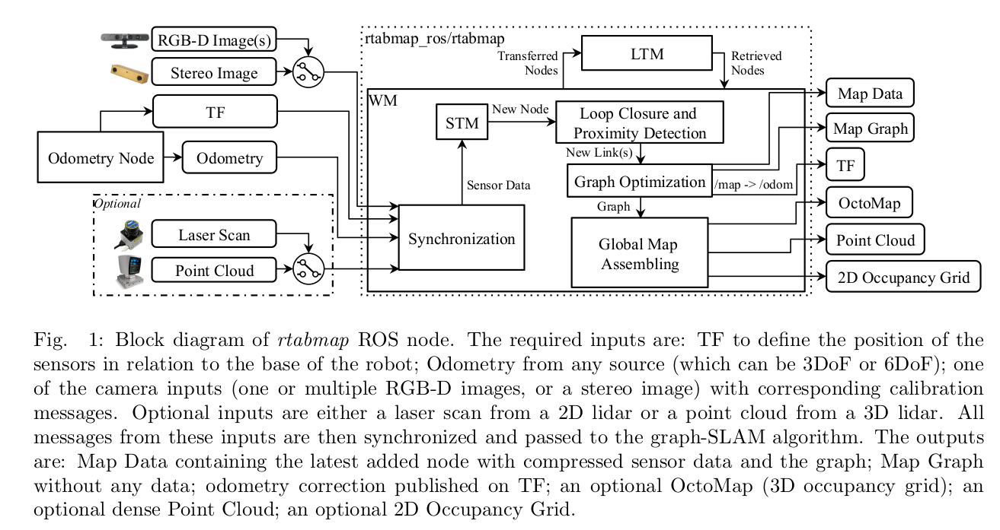

this is a new test, maybe final one/

### Reference

[COMPONENT-BASED SLAM IN RTAB-MAP](RTAB_MAP/COMPONENT-BASED%20SLAM%20IN%20RTAB-MAP.pdf)
[Labbe18JFR_preprint](RTAB_MAP/Labbe18JFR_preprint.pdf)

### ❓ Question

- [x] #Todo How to get uncertainty in motion prediction? 🛫 2022-10-27 ✅ 2022-10-28
- [x] #Ques How do signatures synchronize? ✅ 2022-10-28
- [ ] What is Bayesian filter model?
- [ ]  Accuracy compare between rtab_map and cartographer using only lidar data.
- [ ]  Can odometer and 3d lidar odomtry combine together? If yes, how?s, but this helps me track if something is over due or upcoming.
- [ ]  

---

odd thoughts:

*Kinect + Odometry + Fake 2D laser from Kinect*

*2D laser + Wheel Odometry as guess*

[Wiki](http://wiki.ros.org/rtabmap_ros/Tutorials/SetupOnYourRobot#Kinect_.2B-_2D_laser)

[Is it possible to use rtabmap_ros with only scan data? - ROS Answers: Open Source Q&A Forum](https://answers.ros.org/question/321879/is-it-possible-to-use-rtabmap_ros-with-only-scan-data/)

# Contribution

One of RTAB-Map’s main contributions is the implementation of a memory management system that allows a real time operation on large-scale environments while maintaining long-term mapping.

# Structure

## odometry node

F2F and F2M in case of VO and S2S and S2M in case of LO.

If the correspondence ratio of the current frame is under a predefined threshold, the
new frame is considered as a key frame

### visual odometry

To get a motion prediction with uncertainty: features → PnP RANSAC → local bundle adjustment

[Random sample consensus - Wikipedia](https://en.wikipedia.org/wiki/Random_sample_consensus)

### lidar odometry

To get a motion prediction and uncertainty: point could filtering → ICP

In addition external odometry like wheels odom-etry could be added to improve motion prediction as LiDAR odometry can lose its track if not enough features are detected.

## Graph creation and data storage

### Nodes and links

In RTAB-Map, all the input data is synchronized and stored in the same node, which will be now called signatures. They include:

• ID: Unique time stamp.
• Weight: Importance of the signature. Used for the memory management system.
• BoW: Visual words used for loop closure detection and weight update. This is also known
as the image’s signature.
• Occupancy grid (Labbé and Michaud (2019)).
• Sensor data:
– Pose: Odometry input.
– RGB image: The one used to obtain the features.
– Depth image: Used to find 3D position of the visual words.
– Laser scan: Used for loop closure transformations and odometry refinements, and by the Proximity Detection module.

Note that the GPS data is not stored as a link. The reason for this is that the GPS data is only
used as a prior estimation of a node.

### Memory management

The two main goals of this distinction is: to separate the recently obtained data from the one used in loop closure and to keep a low number of signatures during loop closure detection to remain in real time constraints. 

- STM: It can be seen as a fixed size buffer that processes and stores the most recent sig-
natures, so they do not affect loop closure detection. According to Labbé and Michaud
(2019), here is where the occupancy grid is computed and all the information of the sig-
natures is assembled. According to Labbe and Michaud (2013), there is a previous mem-
ory called Sensory Memory (SM) in which the features extraction and feature reduction is
performed before entering STM. The extracted features are quantized into visual words
using an incremental BoW (BoW).
- WM: This memory contains all the signatures that are candidates for a loop closure. This
memory is usually stored in the so called RAM memory, so only the signatures that are
not candidates for transfer remain in the WM to reduce memory usage and processing
time.
- LTM: This memory stores all the rest of signatures that are neither recent nor candidates
for loop closure. According to Labbe and Michaud (2013) the signatures are stored in a
database containing the link, the signatures’ ID and their signature.

The memories are managed by three main methods that decide whether a signature is stored
in one memory or another:

- Rehearsal: This method operates on top of the STM, reducing the amount of signatures
that enter the WM and updating the weights. This method uses the signatures to de-
termine whether two signatures are too similar. If they are, then it fuses the data and
updates the weight of the signature.
- Retrieval: This is one of the methods that operates between the WM and the LTM. Once
an hypothesis of loop closure is accepted, the neighbouring signatures with higher loop
closure probability are retrieved from LTM to WM. This method allows the system to up-
date the WM with signatures that are candidates of a loop closure.
- Transfer: Opposite to the "Retrieval" method, this one sends the less significant signa-
tures to LTM for long-term storage. This method contains the criteria to evaluate which
signatures to transfer, that is based in two heuristics (Labbé and Michaud (2018)): the
older signatures with less weights have priority to be transferred to LTM and the signa-
tures that are used in path planning must remain in WM.

## Loop closure detection

## Optiimization

# Appendix

## Synchronization

An exact synchronization requires that input topics have exactly the same timestamp, i.e., for
topics coming from the same sensor (e.g., left and right images of a stereo camera). An approximate synchronization compares timestamps of the incoming topics and try to synchronize all topics with a minimum delay error. It is used for topics coming from different sensors.