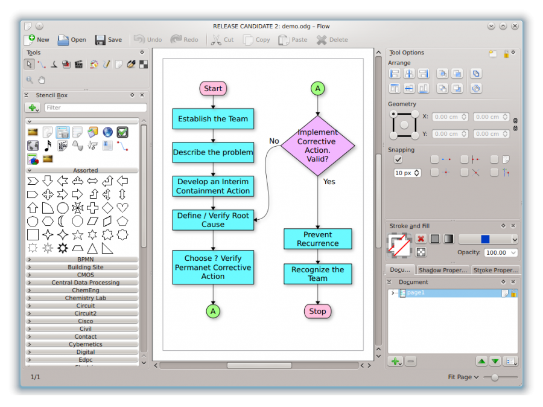
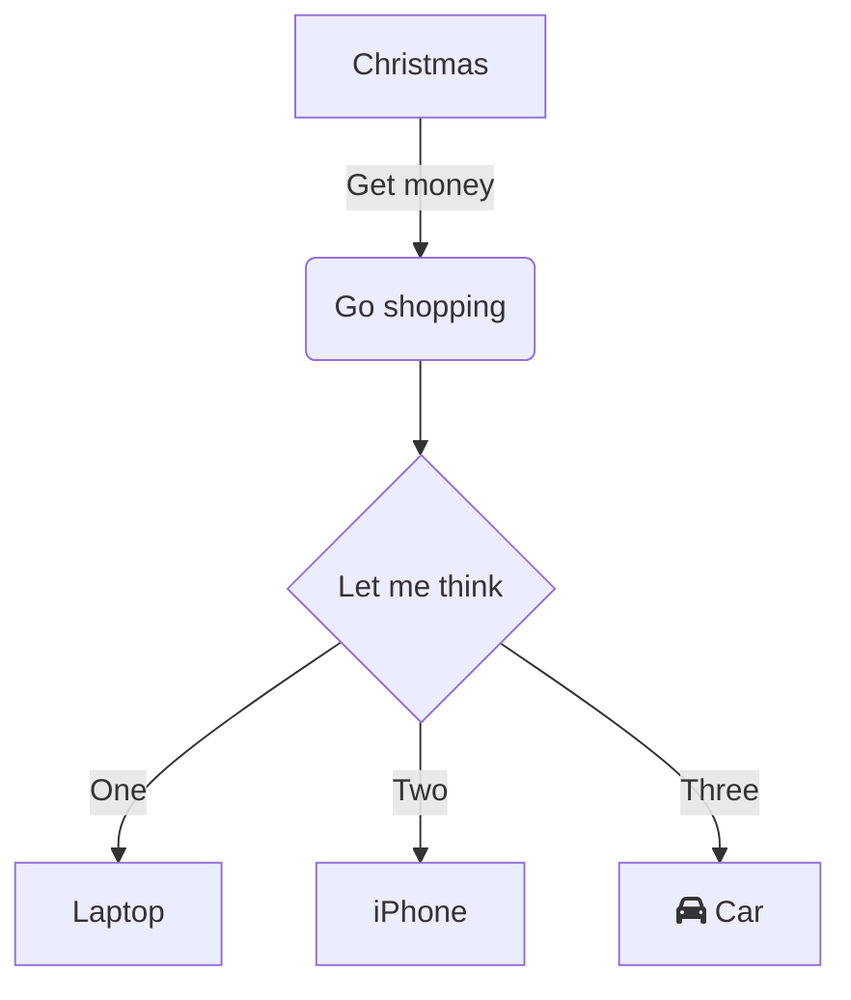

Property: flowchart generation
link: https://graphviz.org/gallery/

## How to use

[dotguide.pdf](Graphviz/dotguide%201.pdf)

create a .dot file in vscode and show it in preview.

```matlab
digraph finite_state_machine {
	fontname="Helvetica,Arial,sans-serif"
	node [fontname="Helvetica,Arial,sans-serif"]
	edge [fontname="Helvetica,Arial,sans-serif"]
	node [shape = octagon] 0 1
	node [shape = ellipse] 2 3
	node [shape = rectangle] 4 5 6 7 8 9

    0 [label="Laser"]
    1 [label="Odometry"]
    2 [label="ROS gmapping"]
    3 [label="openslam gmapping"]
    4 [label="motion model"]
    5 [label="scan match"]
    6 [label="Distribution \nselection"]
    7 [label="Resampling"]
    8 [label="Map maintanance"]
    9 [label="Map update"]

    0 -> 2
    1 -> 2
    2 -> 3
    3 -> 4 -> 5 -> 6 -> 7 -> 8 -> 9 -> 2
}
```

## Example 1

[Graphviz (dot) examples](https://renenyffenegger.ch/notes/tools/Graphviz/examples/index)

[Gallery](https://graphviz.org/gallery/)

## Example 2 (with map)

[Dot image map](https://www.sheep-thrills.net/Dot_image_map.html)

generating both graphics- and map-file output:

```makefile
dot d.dot -Tpng -o d.png -Tcmapx -o d.map
```

Map-output looks something like this:

```
    <map id="X" name="X">
    <area shape="poly" id="node1" href="http://a.com/" title="a" alt="" coords="257,29,256, ...
    <area shape="poly" id="node2" href="local.html" title="b" alt="" coords="221,125,220, ...
    ...
    </map>

```

...which can be used in an HTML-file alongside the generated pic, like this:

```
    <html><head/><body>
    
    <map id="X" name="X">
    <area shape="poly" ...
    ...
    </map>
    </body></html>

```

(Making this 100% HTML-compliant is left as an exercise for the reader.)

## Command

[Command Line](https://graphviz.org/doc/info/command.html)

## Export to yEd

```matlab
gv2gml -o out.gml in.dot
## opposite command is "gml2gv"
```

## Competitors

### DIA

[Dia draws your structured diagrams: Free Windows, Mac OS X and Linux version of the popular open source program](http://dia-installer.de/)

### Calligra Flow

provide rich elements, now is emerged with Karbon



### YED: visual mode change

[yEd Graph Editor](https://www.yworks.com/products/yed)

### draw.io

[https://viewer.diagrams.net/?border=0&tags=%7B%7D&highlight=0000ff&edit=_blank&layers=1&nav=1&open=RvVVNb5wwEP01HLviI197TDfbtFKrHlZVsqfIC1NwahhkhgXy62vwEButskoO7QX5vXljmzczECSbsr%2FXoi5%2BYAYqiMOsD5K7II7XV5F5jsRgiSiME8vkWmbMOWInX2AWMtvKDJqFkBAVyXpJplhVkNKCE1pjt5T9RrU8tRY5nBC7VKhT9kFmVFj25jJ0%2FFeQeTGfHIUcKcUsZqIpRIadRyXbINloRLKrst%2BAGs2bfbF5X96Ivl5MQ0XvSeg3uy3tj%2BtUPF0Pt7dP3166h09cjIaG%2BYUhM%2B%2FPEDUVmGMl1NaxnzW2VQbjrqFBTvMdsTZkZMhnIBq4mKIlNFRBpeIo9JIevfV%2B3Gp1yeiu550nMMygIj08OuEI937MpU1ozjt1iY1rsNUpnLFm7jahc6AzutjqRt%2B8A7gG94AlmPsYgQYlSB6XfSW4PfNXnaugWXARJ%2FirAf3z8Dw2eRwqcQBlU0shK7uZktUfy3VdtzoImbWrFEsbPNsG%2FpW5bbyWcAUfK9YVkmBXi8m8zkz9srhvGn4ETdCftYij8ZpHhj8a8Q3jzk1gNI9V4U3fVfhhVw30jP3A5HDZj0K1bFPTHk6m6X9bdxEurbu4%2FqfWua%2FXFPP%2BAcn2Lw%3D%3D](https://viewer.diagrams.net/?border=0&tags=%7B%7D&highlight=0000ff&edit=_blank&layers=1&nav=1&open=RvVVNb5wwEP01HLviI197TDfbtFKrHlZVsqfIC1NwahhkhgXy62vwEButskoO7QX5vXljmzczECSbsr%2FXoi5%2BYAYqiMOsD5K7II7XV5F5jsRgiSiME8vkWmbMOWInX2AWMtvKDJqFkBAVyXpJplhVkNKCE1pjt5T9RrU8tRY5nBC7VKhT9kFmVFj25jJ0%2FFeQeTGfHIUcKcUsZqIpRIadRyXbINloRLKrst%2BAGs2bfbF5X96Ivl5MQ0XvSeg3uy3tj%2BtUPF0Pt7dP3166h09cjIaG%2BYUhM%2B%2FPEDUVmGMl1NaxnzW2VQbjrqFBTvMdsTZkZMhnIBq4mKIlNFRBpeIo9JIevfV%2B3Gp1yeiu550nMMygIj08OuEI937MpU1ozjt1iY1rsNUpnLFm7jahc6AzutjqRt%2B8A7gG94AlmPsYgQYlSB6XfSW4PfNXnaugWXARJ%2FirAf3z8Dw2eRwqcQBlU0shK7uZktUfy3VdtzoImbWrFEsbPNsG%2FpW5bbyWcAUfK9YVkmBXi8m8zkz9srhvGn4ETdCftYij8ZpHhj8a8Q3jzk1gNI9V4U3fVfhhVw30jP3A5HDZj0K1bFPTHk6m6X9bdxEurbu4%2FqfWua%2FXFPP%2BAcn2Lw%3D%3D)

### Mermaid

[Online FlowChart & Diagrams Editor - Mermaid Live Editor](https://mermaid.live/)



kroki embed

[https://kroki.io/mermaid/svg/eNpVjj0PgjAQhnd_xaWTDsDOYCJFWUh0YGsYalO4ho82bQ0x1v9uwUUvtz3Pe_f2lhuEptxBnBOjaJXzE3ctJMkxVNLDpGf5DFDsKw0OtTFq7g-bXqwO0Fe9WhI8qnl4b4Ru6essA5Ss5sZr0_6AZtEBzkzdMN7-A2hlzFxYx_OOJ4JboNx-DTEqMcSfBL03eZYty5L2yuPjngo9ESANKgdxOYyxCPkAAHNCBw](https://kroki.io/mermaid/svg/eNpVjj0PgjAQhnd_xaWTDsDOYCJFWUh0YGsYalO4ho82bQ0x1v9uwUUvtz3Pe_f2lhuEptxBnBOjaJXzE3ctJMkxVNLDpGf5DFDsKw0OtTFq7g-bXqwO0Fe9WhI8qnl4b4Ru6essA5Ss5sZr0_6AZtEBzkzdMN7-A2hlzFxYx_OOJ4JboNx-DTEqMcSfBL03eZYty5L2yuPjngo9ESANKgdxOYyxCPkAAHNCBw)