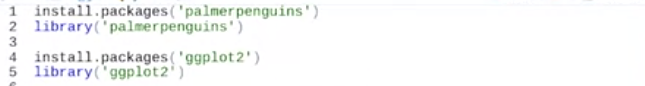

# MySQL with R

This lesson will help you store large amounts of historical data in a structured manner, search and filter that data, and visualize some of the data as a graph.

[Introduction to MySQL with R](https://programminghistorian.org/en/lessons/getting-started-with-mysql-using-r#storing-data-in-a-table-with-sql)

# Quarto

[Migration from Hugo/blogdown/Wowchemy to Quarto](https://www.andreashandel.com/posts/2022-10-01-hugo-to-quarto-migration/index.html)

[Quarto](https://quarto.org/)

# Example

## ggplot

Code:

output:

# Easy Rmarkdown

vscode:

extension `R Markdown All in One` with more snippet inherited from `Markdown All in One`

bold: C-b